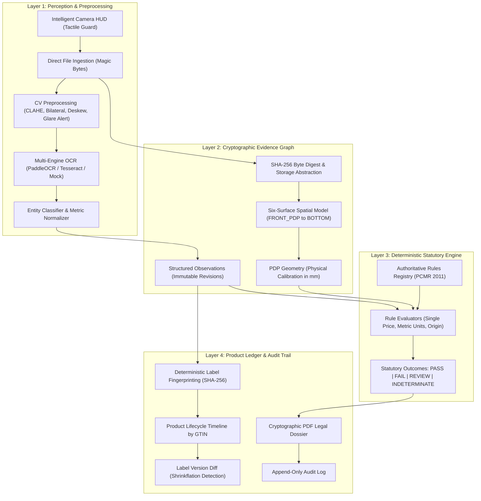

# Metrixa System Architecture & Technical Specifications

> **Domain**: Regulatory Enforcement System for Legal Metrology  
> **Statutory Source**: *Legal Metrology Act, 2009 & Packaged Commodities Rules, 2011*  
> **System Classification**: Trustworthy Metrology Enforcement Platform

---

## 1. High-Level Architectural Model

Metrixa is designed around the fundamental principle of **Strict Separation of Concerns** between sensory perception and legal decision-making.



---

## 2. Key Subsystems & Design Decisions

### 2.1 The Sensory Layer: AI Perception without Legal Hallucinations
In legal enforcement, using a large language model or end-to-end neural network to declare guilt or innocence creates immense legal exposure due to non-deterministic output, hallucination of facts, and lack of statutory explainability.

- **Role of AI in Metrixa**: Confined strictly to **signal perception** (extracting raw bounding polygons, character tokens, and OCR text snippets).
- **Normalizer Engine**: A deterministic regex and parser pipeline converts strings into standardized SI metric units (`QuantityNormalized`), currency amounts (`MRPNormalized`), and contact channels without modifying raw evidence.
- **Ambiguity Detection**: Whenever raw evidence contains conflicting readings (e.g. `03/04/2026` where month and day are both `<= 12`, or dual retail prices), the perception layer designates the entity as `is_ambiguous` or `is_conflicting`, immediately routing it to human adjudication.

### 2.2 Tactile Camera Guard
To safeguard inspector privacy, prevent background battery drain, and eliminate unconsented media streaming:
- Web camera streaming (`navigator.mediaDevices.getUserMedia`) is **isolated inside modal components**.
- No camera stream is initiated upon page load, route transition, or surface tab switching.
- Explicit user interaction (`onClick` on `[Camera HUD]`) is mandatory.
- A zero-dependency fallback `[Upload Photo]` input is consistently present for desktop or hardware-restricted environments.

### 2.3 Six-Surface Packaging Geometry
Physical retail commodities are three-dimensional cuboids, cylinders, or irregular pouches. Violations often hide on lateral or bottom surfaces.
Metrixa models packages with six canonical surface classifications:
1. `FRONT_PDP`: Principal Display Panel (subject to Rule 7 area and font height minimums).
2. `BACK`: Secondary declarations (ingredients, batch numbers).
3. `LEFT`: Lateral manufacturer or distributor details.
4. `RIGHT`: Barcode, customer care, and QR coordinates.
5. `TOP`: Expiry date, manufacturing date, or price embossing.
6. `BOTTOM`: Outer seal or packaging recycling marks.

### 2.4 Cryptographic Evidence Chain & Immutability
- **Byte-Exact SHA-256**: When an image is received, its raw bytes are hashed immediately (`hashlib.sha256(content_bytes).hexdigest()`). The digest is stored alongside image metadata.
- **Append-Only Observation Revisions**: When an officer adjudicates an observation (e.g. changing an OCR error from `Rs. 4S0` to `Rs. 450`), the system creates a new `Observation` record with `revision: 2`, sets `is_latest: false` on revision 1, and links `superseded_by_id`. Raw historical evidence is **never overwritten or deleted**.
- **Audit Logging**: Every adjudication, rule re-evaluation, or report generation writes a row to `audit_logs` capturing `user_id`, `action`, `previous_state`, `new_state`, and `timestamp`.

### 2.5 Deterministic Rule Registry & Evaluators
Authoritative rules are codified from **G.S.R. 202(E)** and formal amendments:
- `PCR-2011-R06-1-A`: Name and complete address of Manufacturer, Packer, or Importer.
- `PCR-2011-R06-1-B`: Generic or common name of the commodity.
- `PCR-2011-R06-1-C`: Net quantity in standard metric units under Rule 12.
- `PCR-2011-R06-1-D`: Date of manufacture, packing, or import (with format clarity checks).
- `PCR-2011-R06-1-DA`: Maximum Retail Price (MRP) with mandatory `"inclusive of all taxes"` clause and single price guarantee.
- `PCR-2011-R06-1-E`: Consumer care coordinates (telephone, email, or physical address).
- `PCR-2011-R06-1-F`: Mandatory Country of Origin declaration for all retail packages.
- `PCR-2011-R06-1-G`: Unit Sale Price (USP) for multi-unit or bulk items.
- `PCR-2011-R07-1`: Principal Display Panel geometry, quadrant placement, and calibrated numeral height.

### 2.6 The Product Ledger & Shrinkflation Detection
Commodities are tracked by their Global Trade Item Number (`GTIN`) or barcode.
- **Deterministic Label Fingerprinting**: Canonical label declarations are sorted, JSON-serialized without whitespace, and hashed via SHA-256:
  ```python
  canonical_str = json.dumps(declarations, sort_keys=True, separators=(",", ":"))
  fingerprint = hashlib.sha256(canonical_str.encode("utf-8")).hexdigest()
  ```
- **Label Version Evolution**: A change in any declaration generates a new `LabelVersion` (`v1.0 -> v2.0`).
- **Version Diffing Engine**: Compares two versions to immediately flag **deceptive shrinkflation** (e.g., net quantity decreasing from 500g to 450g while MRP remains ₹250 or rises to ₹270).

---

## 3. Database Schema Overview

```
 [products] 1 ──< [label_versions]
     │
     └──< [inspections] 1 ──< [inspection_surfaces] 1 ──< [evidence_items]
               │                      │
               │                      └──< [ocr_runs] 1 ──< [ocr_regions]
               │                                │
               │                                └──< [entity_parsing_runs]
               │
               ├──< [observations] (Linked to surface & ocr_region)
               ├──< [pdp_geometries]
               ├──< [rule_evaluations]
               ├──< [inspection_reports]
               └──< [audit_logs]
```

All primary keys use standard RFC 4122 UUIDs (`GUID` mixin) to prevent ID enumeration vulnerabilities. Timestamps are timezone-aware UTC (`DateTime(timezone=True)`).
